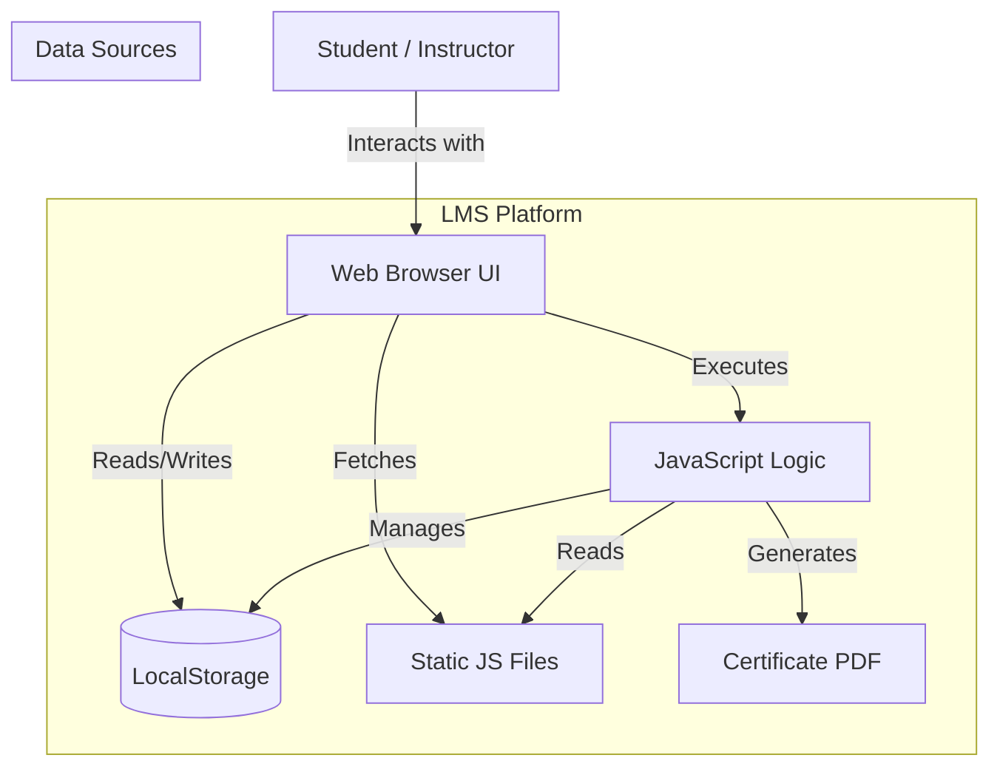

# Architecture Overview

This document provides a comprehensive technical overview of the Atito Civil Academy LMS platform. It is designed to help developers understand the system's structure, data flow, and key components.

## 🏗️ High-Level Architecture

The LMS is architected as a **Client-Side Single Page Application (SPA)**. Although it uses multi-page HTML for routing simplicity, the state management and content rendering are handled dynamically via JavaScript, mimicking SPA behavior.

### System Context Diagram



### Key Characteristics
-   **Client-Side Rendering (CSR)**: The browser handles all HTML generation for courses, quizzes, and dashboards.
-   **Serverless (Current State)**: No active backend server is required. Data persistence is handled via the browser's `localStorage` API.
-   **Modular Design**: Code is organized into distinct layers (UI, Service, Data) to ensure separation of concerns.
-   **Progression Logic**: Use of composite keys (e.g., `courseId_moduleId`) in `localStorage` to enforce sequential module unlocking and certificate access.

## 💾 Data Management

The application uses a hybrid data approach: **Static Data** for content and **LocalStorage** for user state.

### 1. Static Data Models
Content that doesn't change often (Courses, Lessons, Quizzes) is stored in immutable JavaScript objects.

#### Course Model (`js/course-data.js`)
```javascript
{
    id: 'c1',
    title: 'Course Title',
    category: 'Construction',
    skillLevel: 'Beginner',
    description: '...',
    instructor: 'Name',
    modules: [
        {
            id: 'm1',
            title: 'Module Title',
            lessons: [
                { 
                    id: 'l1', 
                    title: 'Lesson Title', 
                    videoUrl: 'path/to/video.mp4', 
                    duration: '10:00' 
                }
            ]
        }
    ]
}
```

#### Quiz Model (`js/quiz-data.js`)
```javascript
{
    'courseId': {
        title: 'Quiz Title',
        questions: [
            {
                id: 1,
                question: 'Question Text?',
                options: ['A', 'B', 'C', 'D'],
                correctAnswer: 1 // Index of correct option
            }
        ]
    }
}
```

### 2. Dynamic Data (Persistence)
User-specific data is stored in `localStorage` as JSON strings.

| Key | Type | Description |
| :--- | :--- | :--- |
| `users` | `Array<User>` | List of all registered users. |
| `user` | `User` | The currently logged-in user session. |
| `course_progress_{userId}_{courseId}` | `Object` | Tracks completed lessons for a specific user/course. |

#### User Model
```javascript
{
    id: 'timestamp_id',
    name: 'John Doe',
    email: 'john@example.com',
    password: '...', // Plaintext for demo only
    role: 'student', // 'student' | 'admin' | 'instructor'
    enrolledCourses: ['c1', 'c3'],
    completedCourses: ['c1'], // List of course IDs passed (>70% final exam)
    completedModules: ['c1_m1', 'c1_m2'], // Composite keys (courseId_moduleId) for passed modules (>70%)
    createdAt: 'ISO_Date_String'
}
```

## 🧩 Component Architecture

The application logic is split into three main layers:

### 1. Service Layer
Handles business logic and data manipulation.
-   **`Auth` (`js/auth.js`)**: Manages registration, login, logout, and session validation.
-   **`CourseService` (`js/course-data.js`)**: Provides methods to fetch courses (`getAll`, `getById`, `getByCategory`).
-   **`QuizService` (`js/quiz-data.js`)**: Handles quiz retrieval and score calculation.

### 2. UI Layer
Handles DOM manipulation and user interaction.
-   **`UI` (`js/ui.js`)**: Reusable UI components like Toasts (notifications) and Modals.
-   **`Utils` (`js/utils.js`)**: Helper functions for formatting dates, durations, and validating inputs.

### 3. Page Controllers
Specific scripts that glue the Service and UI layers together for each page.
-   **`dashboard-page.js`**: Orchestrates the user dashboard, fetching enrolled courses and calculating progress. Displays "Cert" button for completed courses or "Final Exam" button for incomplete ones.
-   **`course-detail-page.js`**: Renders the course syllabus and handles the "Enroll" action. Implements module locking by checking `user.completedModules` array before rendering each module.
-   **`quiz.js`**: Manages quiz state, scoring, and completion tracking:
    -   Loads questions based on `type` parameter (`module` or `final`).
    -   Implements 70% pass threshold.
    -   Saves completion to `localStorage`:
        -   Module quizzes → `completedModules` (composite key: `courseId_moduleId`) - NO certificate button shown
        -   Final exam → `completedCourses` (courseId) - Certificate button shown only for final exams
-   **`video-player.js`**: Manages the video player state and marks lessons as "Completed".
-   **`certificate.js`**: Validates course completion from `user.completedCourses` before generating PDF certificate using `jspdf`.

## 🔐 Quiz & Progression System

### Pass Mark & Grading
-   **Pass Threshold**: 70% or higher on all assessments (module quizzes and final exam).
-   **Scoring**: Calculated as `(correctAnswers / totalQuestions) * 100`.

### Module Locking Logic
1.  **Sequential Access**: Modules must be completed in order. Module N is locked until Module N-1 is passed.
2.  **Composite Keys**: Completion tracked using `${courseId}_${moduleId}` format in `user.completedModules`.
3.  **UI Rendering**: `course-detail-page.js` checks previous module completion:
    ```javascript
    if (index > 0) {
        const prevModuleKey = `${courseId}_${prevModule.id}`;
        if (!completedModules.includes(prevModuleKey)) {
            isLocked = true; // Render as locked
        }
    }
    ```

### Certificate Access Control
1.  **Requirement**: User must pass the Final Exam (>= 70%). Module quiz completions do NOT award certificates.
2.  **Validation**: `certificate.js` checks `user.completedCourses` array (only populated after final exam passes).
3.  **Redirect**: If course not found in array, user is redirected to dashboard with an alert.
4.  **Certificate Button**: Only visible in quiz results after passing the **final exam** (`type === 'final'`). Module quiz results do NOT show certificate button, even with passing scores.

## 🎨 Styling Architecture

CSS is organized to promote reusability and consistency.

-   **`style.css`**: The core stylesheet. Contains CSS Variables (Colors, Fonts), Reset, and Global Typography.
-   **`navbar.css` / `footer.css`**: Component-specific styles.
-   **`utils.css`**: Utility classes for spacing, text alignment, and visibility (e.g., `.mt-1`, `.text-center`).

## 🔄 Future Scalability Roadmap

To transition this MVP into a production-ready system:

1.  **Backend Migration**:
    -   Replace `localStorage` with a RESTful API (Node.js/Express).
    -   Migrate `users` data to a secure database (MongoDB/PostgreSQL).
    -   Implement JWT (JSON Web Tokens) for secure authentication.

2.  **Content Delivery**:
    -   Move static video assets to a CDN (AWS S3 + CloudFront) or a video hosting service (Vimeo/YouTube API).

3.  **State Management**:
    -   Introduce a lightweight state management library if interaction complexity increases.
